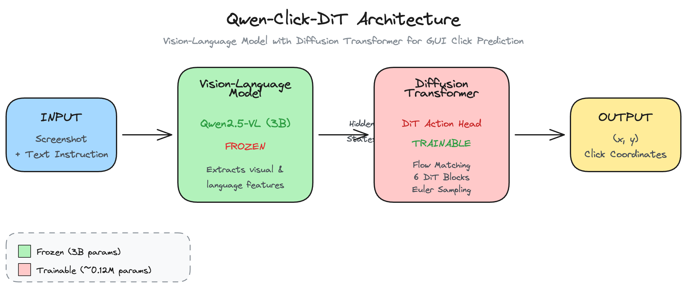

# Qwen-Click-DiT

<div align="center">

**Vision-Language Model with Diffusion Transformer for GUI Click Prediction**

[](https://huggingface.co/TESS-Computer/qwen-click-dit)
[](https://huggingface.co/datasets/Salesforce/grounding_dataset)
[](https://husseinxyz.com/tess/qwen-click-dit/)



</div>

---

Click prediction model using **Qwen2.5-VL-3B** as a frozen vision-language backbone with a **Diffusion Transformer (DiT)** action head trained via **flow matching**.

Given a screenshot and a text instruction like *"Click on the search button"*, the model predicts the (x, y) coordinates of where to click.

## Architecture

```
Input: Screenshot + Text instruction ("Click on the search button")
                    ↓
    ┌───────────────────────────────┐
    │     Qwen2.5-VL (Frozen)       │
    │  • Vision Transformer         │
    │  • Language Model (3B)        │
    └───────────────────────────────┘
                    ↓ hidden states (conditioning)
    ┌───────────────────────────────┐
    │   DiT Action Head (Trained)   │
    │  • ActionEncoder              │
    │  • 6× DiT Transformer Blocks  │
    │  • ActionDecoder              │
    │  • Flow Matching Loss         │
    └───────────────────────────────┘
                    ↓
    Output: (x, y) normalized coordinates [0, 1]
```

## Method

### Flow Matching (from NVIDIA GR00T)

Instead of directly regressing coordinates, we train a diffusion model:

1. **Forward process**: Interpolate between noise and target
   ```
   noisy_action = (1 - t) * noise + t * action
   velocity = action - noise
   ```

2. **Training**: Predict the velocity field
   ```
   loss = MSE(predicted_velocity, target_velocity)
   ```

3. **Inference**: Euler integration from noise to action (16 steps)
   ```
   action = noise
   for t in range(16):
       velocity = model(action, t)
       action = action + velocity * dt
   ```

### DiT Action Head Components

| Component | Description |
|-----------|-------------|
| **ActionEncoder** | Encodes noisy actions + timestep via sinusoidal positional encoding |
| **DiT Blocks** | Transformer blocks with AdaLayerNorm (timestep conditioning) + cross-attention to VLM features |
| **ActionDecoder** | 2-layer MLP that decodes to (x, y) coordinates |

## Installation

```bash
git clone https://github.com/husseinxyz/Qwen-Clicking-DiT.git
cd Qwen-Clicking-DiT
pip install -r requirements.txt
pip install flash-attn --no-build-isolation  # Optional, for faster attention
```

## Quick Start

### Training

```bash
./scripts/train_click.sh
```

Or manually:
```bash
export PYTHONPATH=src:$PYTHONPATH

python -m src.train.train_click \
    --model_id Qwen/Qwen2.5-VL-3B-Instruct \
    --data_path Salesforce/grounding_dataset \
    --output_dir outputs/click_dit \
    --bf16 True \
    --num_train_epochs 3 \
    --per_device_train_batch_size 4 \
    --gradient_accumulation_steps 4 \
    --learning_rate 1e-4 \
    --image_min_pixels 200704 \
    --image_max_pixels 401408
```

### Inference

```bash
export PYTHONPATH=src:$PYTHONPATH

python -m src.inference.predict_click \
    --model_path outputs/click_dit \
    --image_path screenshot.png \
    --prompt "Click on the search button"
```

Output:
```
Result:
  Normalized: (0.4521, 0.3218)
  Pixels:     (867, 463) on 1920x1440 image
```

### Python API

```python
from src.inference import load_model, predict

model, processor = load_model("outputs/click_dit")
x, y = predict(model, processor, "screenshot.png", "Click on the submit button")

# Convert to pixels
image_width, image_height = 1920, 1080
pixel_x = int(x * image_width)
pixel_y = int(y * image_height)
```

## Project Structure

```
├── src/
│   ├── model/
│   │   └── modeling_click.py      # Qwen2.5-VL + DiT action head
│   ├── dataset/
│   │   └── click_dataset.py       # Data loading for grounding datasets
│   ├── train/
│   │   └── train_click.py         # Training script
│   └── inference/
│       └── predict_click.py       # Inference script
├── scripts/
│   ├── benchmark.py               # Evaluation script
│   ├── visualize_predictions.py   # Visualization script
│   └── upload_to_hub.py           # HuggingFace upload script
├── modal_train.py                 # Modal cloud training
└── README.md
```

## Configuration

### DiT Head
| Parameter | Default | Description |
|-----------|---------|-------------|
| `dit_hidden_size` | 512 | Hidden dimension |
| `dit_num_layers` | 6 | Transformer blocks |
| `dit_num_heads` | 8 | Attention heads |
| `dit_dropout` | 0.1 | Dropout rate |
| `num_inference_steps` | 16 | Euler integration steps |

### Image Resolution
| Parameter | Default | Description |
|-----------|---------|-------------|
| `image_min_pixels` | 200704 | Min pixels (256×28×28) |
| `image_max_pixels` | 401408 | Max pixels (512×28×28) |

## Benchmarking

### Run Evaluation
```bash
python scripts/benchmark.py \
    --model_path outputs/click_dit \
    --num_samples 1000
```

### Visualize Predictions
```bash
# From dataset samples
python scripts/visualize_predictions.py \
    --model_path outputs/click_dit \
    --from_dataset \
    --num_samples 20 \
    --output_dir visualizations/

# Single image
python scripts/visualize_predictions.py \
    --model_path outputs/click_dit \
    --image_path screenshot.png \
    --prompt "Click on the search button" \
    --bbox "100,200,300,250" \
    --output_path result.png
```

## Dataset Format

The model expects HuggingFace datasets with:
- `image`: PIL Image
- `bbox`: Bounding box `[x0, y0, x1, y1]` (click = center of box)
- `conversations` or `prompt`: Text instruction

Trained on: [Salesforce/grounding_dataset](https://huggingface.co/datasets/Salesforce/grounding_dataset) (20k samples)

## References

- [NVIDIA GR00T N1](https://arxiv.org/abs/2503.14734) - Flow matching for robot actions
- [MineDojo/NitroGen](https://github.com/MineDojo/NitroGen) - Diffusion-based action generation inspiration
- [Qwen2.5-VL](https://huggingface.co/Qwen/Qwen2.5-VL-3B-Instruct) - Vision-language backbone
- [2U1/Qwen-VL-Series-Finetune](https://github.com/2U1/Qwen-VL-Series-Finetune) - Training framework

## Acknowledgements

Built on top of [2U1/Qwen-VL-Series-Finetune](https://github.com/2U1/Qwen-VL-Series-Finetune) training framework. Inspired by [MineDojo/NitroGen](https://github.com/MineDojo/NitroGen) for diffusion-based action generation.

## License

MIT
